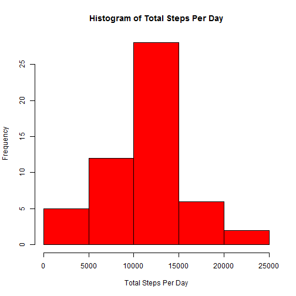
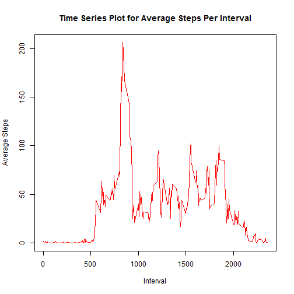
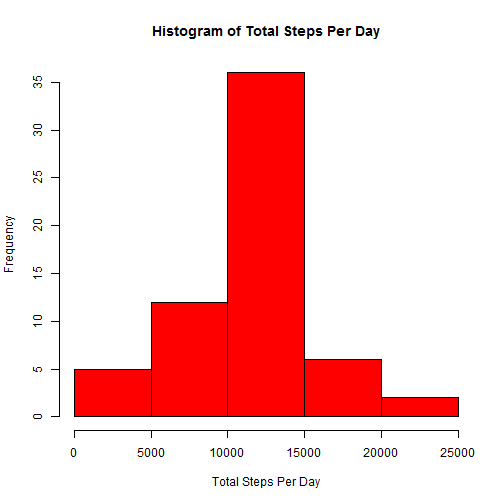
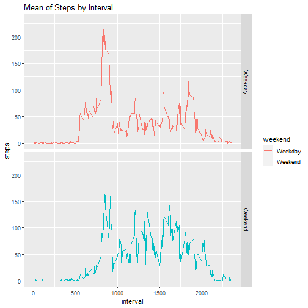

Reproducible Research: Project 1  
===================================


##Loading and preprocessing the data
1. Load the data  

```r
activity_raw <- read.table("activity.csv", header = TRUE, sep = ",")
```

2. Process/transform the data (if necessary) into a format suitable for your analysis

```r
activity_raw$date <- as.Date(as.character(activity_raw$date))
```

3. Cleaning Data (removing missing values)  

```r
activity_NA <- is.na(activity_raw$steps)  
activity_clean <- activity_raw[!activity_NA,]  
str(activity_clean)
```

```
## 'data.frame':	15264 obs. of  3 variables:
##  $ steps   : int  0 0 0 0 0 0 0 0 0 0 ...
##  $ date    : Date, format: "2012-10-02" "2012-10-02" ...
##  $ interval: int  0 5 10 15 20 25 30 35 40 45 ...
```

##What is mean total number of steps taken per day?
1. Calculate the total number of steps taken per day

```r
steps_per_day <- aggregate(activity_clean$steps, by=list(activity_clean$date), sum)
names(steps_per_day) <- c("date", "TotalSteps")
head(steps_per_day)
```

```
##         date TotalSteps
## 1 2012-10-02        126
## 2 2012-10-03      11352
## 3 2012-10-04      12116
## 4 2012-10-05      13294
## 5 2012-10-06      15420
## 6 2012-10-07      11015
```

2. If you do not understand the difference between a histogram and a barplot, research the difference between them. Make a histogram of the total number of steps taken each day

```r
hist(steps_per_day$TotalSteps,
     xlab = "Total Steps Per Day",
     col = "red",
     main = "Histogram of Total Steps Per Day")
```



3. Calculate and report the mean and median of the total number of steps taken per day

```r
mean(steps_per_day$TotalSteps)
```

```
## [1] 10766.19
```

```r
median(steps_per_day$TotalSteps)
```

```
## [1] 10765
```

##What is the average daily activity pattern?
1. Make a time series plot (i.e. \color{red}{\verb|type = "l"|}type="l") of the 5-minute interval (x-axis) and the average number of steps taken, averaged across all days (y-axis)

```r
mean_by_interval <- aggregate(activity_clean$steps, by=list(activity_clean$interval), mean)
names(mean_by_interval) <- c("interval", "MeanSteps")

plot(mean_by_interval$interval,
     mean_by_interval$MeanSteps,
     type = "l",
     main = "Time Series Plot for Average Steps Per Interval",
     xlab = "Interval",
     ylab = "Average Steps",
     col = "red")
```



2. Which 5-minute interval, on average across all the days in the dataset, contains the maximum number of steps?

```r
max_steps_interval <- mean_by_interval[which.max(mean_by_interval$MeanSteps),]
print(max_steps_interval)
```

```
##     interval MeanSteps
## 104      835  206.1698
```

##Imputing missing values
1. Calculate and report the total number of missing values in the dataset (i.e. the total number of rows with \color{red}{\verb|NA|}NAs)

```r
missing_values <- sum(activity_NA)
print(missing_values)
```

```
## [1] 2304
```

2. Devise a strategy for filling in all of the missing values in the dataset. The strategy does not need to be sophisticated. For example, you could use the mean/median for that day, or the mean for that 5-minute interval, etc.

```r
strategy <- "Strategy: Use mean interval steps from Mean Steps for that interval."
print(strategy)
```

```
## [1] "Strategy: Use mean interval steps from Mean Steps for that interval."
```

3. Create a new dataset that is equal to the original dataset but with the missing data filled in.

```r
activity_impute <- activity_raw
meanVals <- tapply(activity_clean$steps, activity_clean$interval, mean, na.rm=TRUE, simplify=TRUE)
activity_impute$steps[activity_NA] <- meanVals[as.character(activity_impute$interval[activity_NA])]
head(activity_impute)
```

```
##       steps       date interval
## 1 1.7169811 2012-10-01        0
## 2 0.3396226 2012-10-01        5
## 3 0.1320755 2012-10-01       10
## 4 0.1509434 2012-10-01       15
## 5 0.0754717 2012-10-01       20
## 6 2.0943396 2012-10-01       25
```

```r
sum(is.na(activity_impute$steps))
```

```
## [1] 0
```

4. Make a histogram of the total number of steps taken each day and Calculate and report the mean and median total number of steps taken per day. Do these values differ from the estimates from the first part of the assignment? What is the impact of imputing missing data on the estimates of the total daily number of steps?

```r
steps_per_day <- aggregate(activity_impute$steps, by=list(activity_impute$date), sum)
names(steps_per_day) <- c("date", "TotalSteps")

hist(steps_per_day$TotalSteps,
     xlab = "Total Steps Per Day",
     col = "red",
     main = "Histogram of Total Steps Per Day")
```



```r
mean(steps_per_day$TotalSteps)
```

```
## [1] 10766.19
```

```r
median(steps_per_day$TotalSteps)
```

```
## [1] 10766.19
```

##Are there differences in activity patterns between weekdays and weekends?
1. Create a new factor variable in the dataset with two levels - "weekday" and "weekend" indicating whether a given date is a weekday or weekend day.

```r
activity_impute$weekday <- weekdays(activity_impute$date)
activity_impute$weekend <- ifelse(activity_impute$weekday == "Saturday" | activity_impute$weekday == "Sunday", "Weekend", "Weekday")
head(activity_impute)
```

```
##       steps       date interval weekday weekend
## 1 1.7169811 2012-10-01        0  Monday Weekday
## 2 0.3396226 2012-10-01        5  Monday Weekday
## 3 0.1320755 2012-10-01       10  Monday Weekday
## 4 0.1509434 2012-10-01       15  Monday Weekday
## 5 0.0754717 2012-10-01       20  Monday Weekday
## 6 2.0943396 2012-10-01       25  Monday Weekday
```

2. Make a panel plot containing a time series plot (i.e. \color{red}{\verb|type = "l"|}type="l") of the 5-minute interval (x-axis) and the average number of steps taken, averaged across all weekday days or weekend days (y-axis). See the README file in the GitHub repository to see an example of what this plot should look like using simulated data.

```r
mean_by_interval_weekend <- aggregate(activity_impute$steps, by = list(activity_impute$weekend, activity_impute$interval), mean)
names(mean_by_interval_weekend) <- c("weekend", "interval", "MeanSteps")

ggplot(mean_by_interval_weekend, aes(x = interval, y=MeanSteps, color=weekend)) +
    geom_line() +
    facet_grid(weekend ~ .) +
    labs(title = "Mean of Steps by Interval", x = "interval", y = "steps")
```



